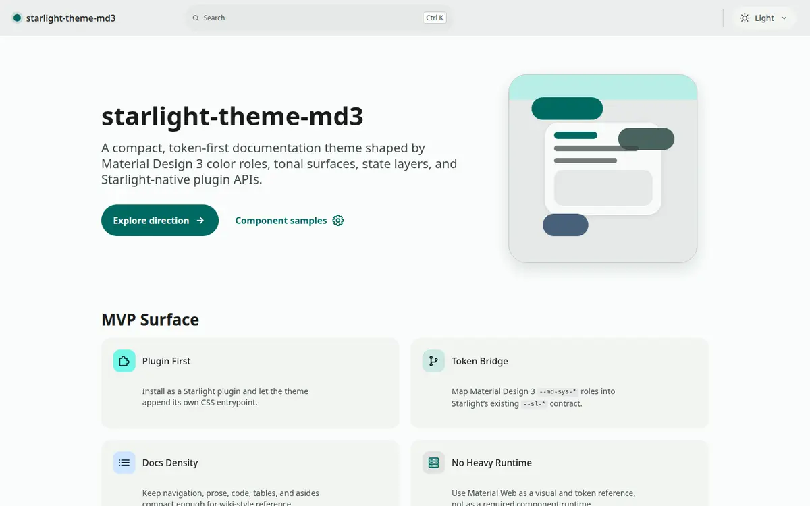
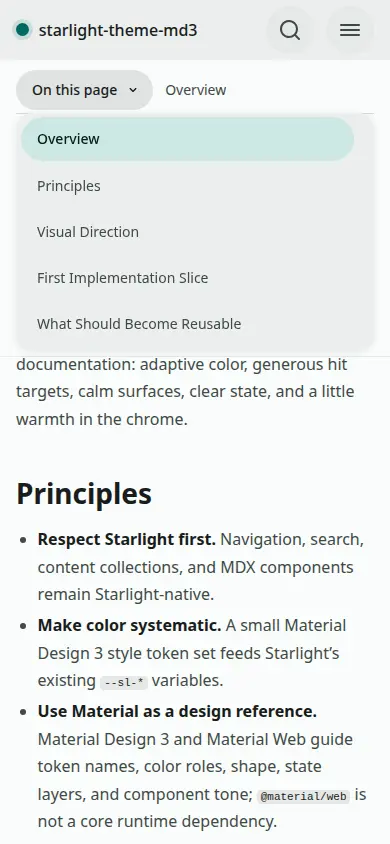
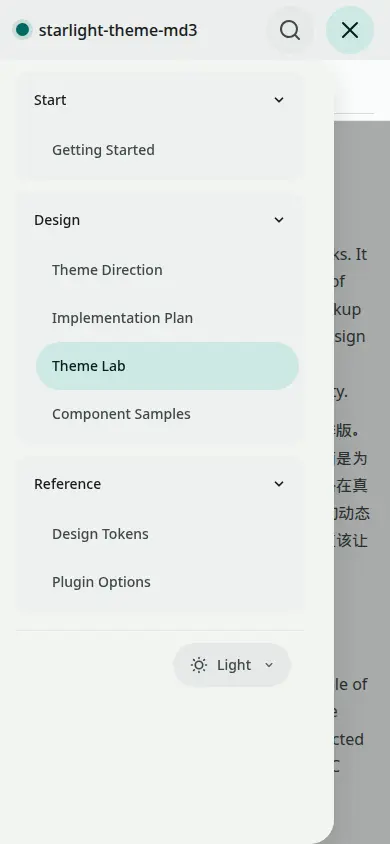
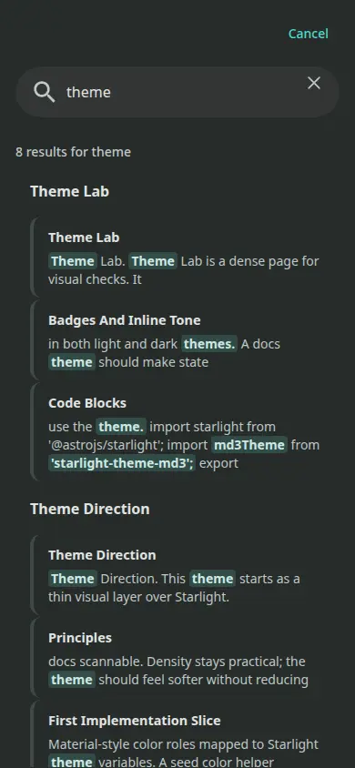

# starlight-theme-md3

[](https://starlight.astro.build)

[English](../README.md) | 简体中文

`starlight-theme-md3` 是一个面向 Astro Starlight 的 Material Design 3 /
Material You 风格主题原型。它保留 Starlight 原生的导航、搜索、目录和内容
模型，通过 CSS variables、Starlight plugin 和少量行为增强叠加 MD3 的颜色、
形状、表面、状态层、排版和动效。

这个主题不要求用户配置 Tailwind，也不会把 `@material/web` 作为运行时依赖。
用户侧的集成方式保持简单：

```ts
plugins: [md3Theme()]
```

## 预览

<picture>
  <source media="(prefers-color-scheme: dark)" srcset="readme/home-desktop-dark.webp">
  
</picture>

<p align="center">
  
  
  
</p>

## 安装

```sh
npm install starlight-theme-md3
```

## 使用

```ts
import { defineConfig } from 'astro/config';
import starlight from '@astrojs/starlight';
import md3Theme from 'starlight-theme-md3';

export default defineConfig({
	integrations: [
		starlight({
			title: 'My Docs',
			plugins: [
				md3Theme({
					seed: '#00a99d',
					variant: 'tonalSpot',
					density: 'compact',
					shape: 'medium',
				}),
			],
		}),
	],
});
```

## 配置项

| 配置项 | 可选值 | 默认值 | 说明 |
| --- | --- | --- | --- |
| `preset` | `neutral`, `playful`, `highContrast` | 无 | 常用文档风格预设 |
| `seed` | `#rgb` 或 `#rrggbb` | 无 | 生成浅色/深色 Material 色彩角色 |
| `variant` | `tonalSpot`, `expressive`, `content` | `tonalSpot` | seed 色彩的解释方式 |
| `accent` | `teal`, `purple`, `blue`, `green`, `orange`, `rose` | `teal` | 未传入 `seed` 时的命名色彩预设 |
| `density` | `compact`, `comfortable` | `compact` | 控制导航、正文、卡片和控件密度 |
| `shape` | `small`, `medium`, `large` | `medium` | 控制 MD3 圆角尺度 |
| `contrast` | `standard`, `medium`, `high` | `standard` | 控制状态层、描边和选中态强调程度 |
| `tonalSurface` | `boolean` | `true` | 控制是否使用色调表面层级 |
| `motion` | `boolean` | `true` | 控制主题交互动效运行时 |
| `experimentalComponents` | `boolean` | `false` | 预留给未来 Astro 组件 override |

`preset` 只填充默认配置。显式传入的 `seed`、`shape`、`tonalSurface`
等选项会覆盖预设。

## 全局换色

推荐通过 `seed` 一键调整主题色：

```ts
md3Theme({
	seed: '#6750a4',
	variant: 'tonalSpot',
});
```

`seed` 会在 Astro 配置阶段通过 `@material/material-color-utilities`
生成浅色和深色模式的 Material color roles。修改这一处即可影响整个主题的
primary、secondary、tertiary、surface、container 和 selected state。

如果不传 `seed`，主题会回退到命名 `accent`：

```ts
md3Theme({
	accent: 'blue',
});
```

## 设计原则

- **Token-first**：用 `--md-sys-*` 系统 token 承载颜色、形状、排版、动效和状态。
- **Docs-native**：保留 Starlight 原生内容集合、导航、搜索、TOC 和 MDX 组件模型。
- **CSS before overrides**：优先用 CSS variables 和 cascade layers 解决视觉问题。
- **No heavy runtime**：Material Web 只作为设计参考，不作为主题运行时依赖。
- **Material, but scannable**：引入 MD3 的色调表面、状态层、圆角和动效，同时保持文档的信息密度。

## CSS 分层

主题声明 Starlight 内置 layers，并在其后追加 MD3 layers：

- `md3.tokens`：系统 token、组件 token、密度、形状、动效和状态层。
- `md3.bridge`：把 MD3 token 映射到 Starlight 的 `--sl-*` 变量。
- `md3.layout`：顶栏、侧栏、TOC、页面布局和分页。
- `md3.prose`：正文排版、标题、段落、列表和中文阅读节奏。
- `md3.components`：卡片、aside、tabs、badges、search 和主题菜单等组件表面。
- `md3.code`：代码块、inline code 和语法高亮容器。
- `md3.utilities`：文档 demo 和局部工具类。

## 项目结构

```txt
.
├── docs/
│   ├── README.zh-CN.md
│   └── readme/
├── public/
├── src/
│   ├── content/
│   │   └── docs/
│   ├── index.ts
│   ├── styles/
│   │   └── md3/
│   └── content.config.ts
├── astro.config.mjs
├── package.json
└── tsconfig.json
```

## 常用命令

| 命令 | 作用 |
| --- | --- |
| `pnpm install` | 安装依赖 |
| `pnpm dev` | 启动 demo 开发服务器 |
| `pnpm build:theme` | 构建主题包到 `dist/` |
| `pnpm build:demo` | 构建 demo 站点到 `demo-dist/` |
| `pnpm build` | 同时构建主题包和 demo 站点 |
| `pnpm check:contrast` | 检查核心 MD3 前景/背景对比度 |
| `pnpm test:screenshots` | 运行 Playwright 视觉回归测试 |
| `pnpm test:screenshots:update` | 更新 Playwright 截图基线 |
| `pnpm typecheck` | 运行 `astro check` |
| `pnpm pack --dry-run` | 检查 npm package 内容 |

## 部署 Demo

Demo 可以通过 `.github/workflows/deploy-pages.yml` 部署到 GitHub Pages。
在仓库设置中启用 **Settings -> Pages -> Source: GitHub Actions**，然后推送
到 `main` 或手动运行 workflow。

该 workflow 会从 `actions/configure-pages` 读取 Pages origin 和 base path，
并通过 `ASTRO_SITE`、`ASTRO_BASE` 传给 Astro，因此项目页路径例如
`https://<user>.github.io/<repo>/` 可以正确构建。

## 当前状态

- Starlight 已安装并在 `astro.config.mjs` 中配置。
- `src/index.ts` 暴露 `md3Theme()` Starlight plugin。
- `src/styles/md3/` 包含拆分后的 MD3 CSS 源文件。
- `src/styles/md3/component-tokens.css` 提供本地 `--md3-comp-*` 组件 token。
- `src/palette.ts` 使用 `@material/material-color-utilities` 生成 seed 色彩角色。
- `dist/css/index.css` 在 `pnpm run build:theme` 时由 Lightning CSS 打包生成。
- Theme Lab、组件样例、设计 token、插件选项和实现概览文档已经存在。
- Playwright 覆盖首页、Theme Lab、桌面文档页、搜索弹窗、移动端 drawer、移动端 TOC 和主题菜单状态。
- GitHub Actions 覆盖 install、typecheck、contrast、build、package consumption 和 pack dry-run。

## 当前限制

- `tonalSpot` 和 `content` 使用 Material Color Utilities core palettes。
- `expressive` 暂时使用 HCT 近似，因为较新的 DynamicScheme 入口在目标 Node ESM 矩阵中仍不稳定。
- 组件 override 暂时延后，除非 CSS-first 方案遇到真实边界。
- 当前仍处于 v0.x 阶段，部分选项名和 public-preview token 可能在稳定前调整。
